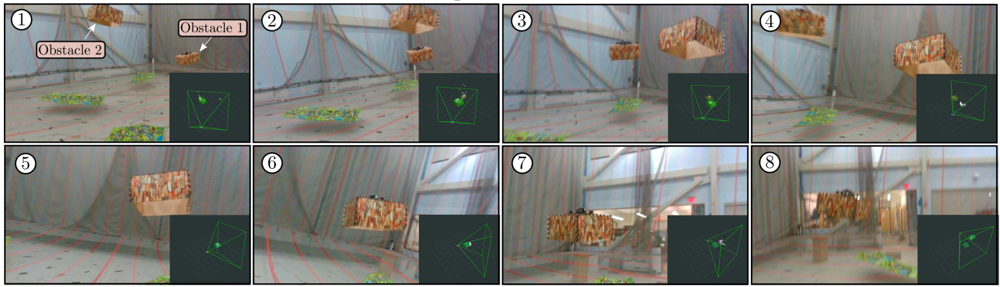
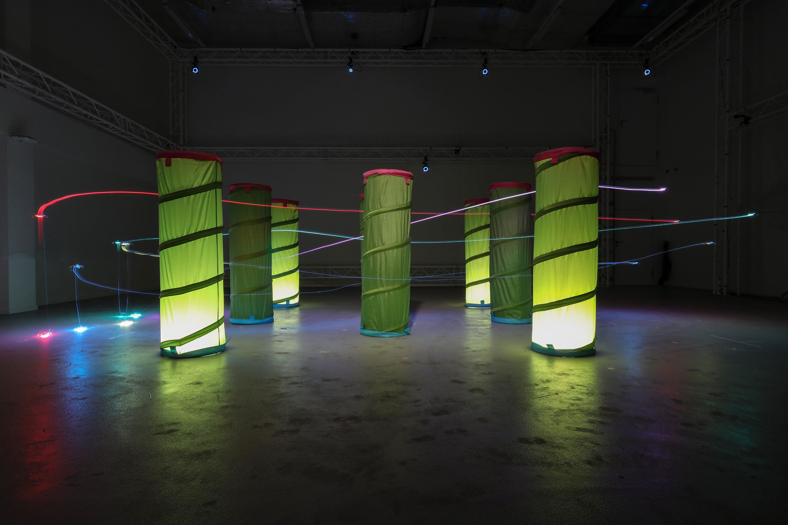
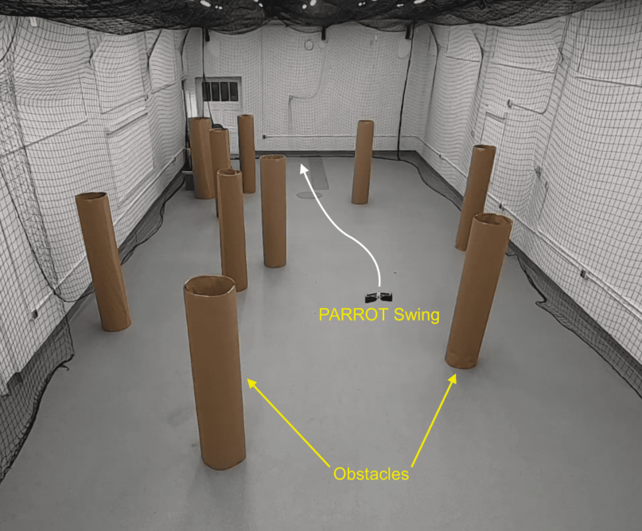
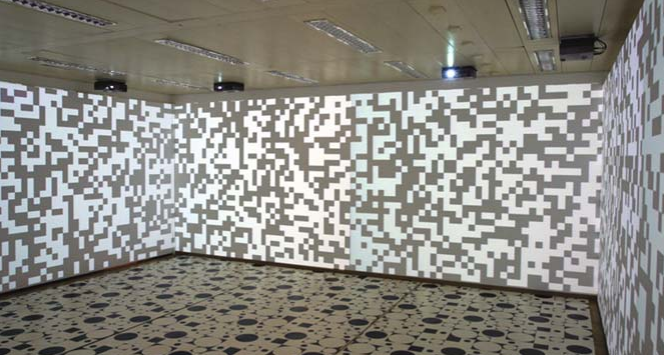

# ExperimentSetupIdeas
Ideas for Experimental Setup in robotics

## Indoor Experiments

#### Dynamic Obstacles

  

- Uses a drone as a "controllable" dynamic obstacle. Attaches yoga mats on sides of drone to make it look "boxy".
- [Product Source](https://www.amazon.com/We-Sell-Mats-Printed-Interlocking/dp/B003R2JATU/ref=sr_1_6?crid=KA0M5UZGZAKZ&keywords=wood+yoga+mat&qid=1651384106&sprefix=wood+yoga+mat%2Caps%2C51&sr=8-6)
- [Paper Source](https://arxiv.org/abs/2103.06372)

#### Fake Forest

  

- Uses a Kid's play tunnel as an analog for a tree. A safe and cheap way to make an indoor forest.
- [Product Source](https://www.ikea.com/us/en/p/busa-play-tunnel-90192014/)
- [Paper Source](https://www.nature.com/articles/s42256-021-00341-y.epdf?sharing_token=_Wl1DQ3laeWWCEZyjp7RRNRgN0jAjWel9jnR3ZoTv0MlzRIoUiX4JTNmwajyH_BxCPoTeGp7xgOmYjKtesI0gtonbV1zNDW5NdRCzpdo9gF4rTWKo3-qc1X_AXj-o7W_2LpcS6QNnN-J2ZWToL4EuqlBpw6d91PDPGXbnWNV9pMbU6yzjDPy8zZUXjeNo3P3j6qRaEgpB9mr6BOmdF0V_2Z1kLZG7uMG4hmtb9FpgjY%3D&tracking_referrer=www.wired.com)

#### Fake Forest 2

  

- Uses a conrete form tube or a rolled up carboard as an analog for a tree. A safe and cheap way to make an indoor forest.

- [Product Source](https://www.homedepot.com/p/Quikrete-24-in-x-48-in-Tube-for-Concrete-692206/205442933)
- [Product Source 2](https://www.amazon.com/Chipboard-Sheets-8-5-Alternative-Cardboard/dp/B08LR2TBPG/ref=sr_1_1_sspa?dchild=1&keywords=paperboard&qid=1625247263&sr=8-1-spons&psc=1&spLa=ZW5jcnlwdGVkUXVhbGlmaWVyPUEyQ0Q0OFRJWTE0MUlLJmVuY3J5cHRlZElkPUEwMDQ1MDM0MUhVUDFVNURESVVYWSZlbmNyeXB0ZWRBZElkPUEwMjU3NTE0MVI3NURPVkk5TVU0NiZ3aWRnZXROYW1lPXNwX2F0ZiZhY3Rpb249Y2xpY2tSZWRpcmVjdCZkb05vdExvZ0NsaWNrPXRydWU=)
- [Paper Source](https://arxiv.org/abs/1806.04225)

#### Hallucinating different backgrounds

  

- Uses a set of projectors to change visual information on the walls.

- [Product Source](https://www.bestbuy.com/site/vankyo-performance-v630-1080p-projector-white/6419996.p?skuId=6419996)
- [Paper Source](https://link.springer.com/content/pdf/10.1007%2F978-3-540-89393-6.pdf)

## Outdoor Experiments

